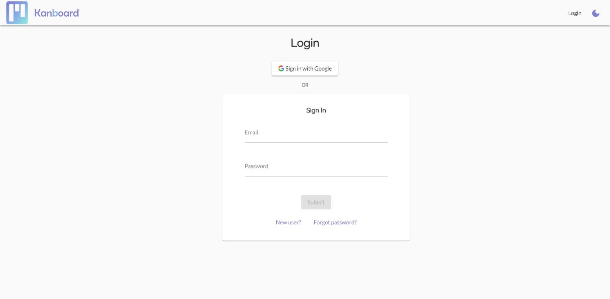
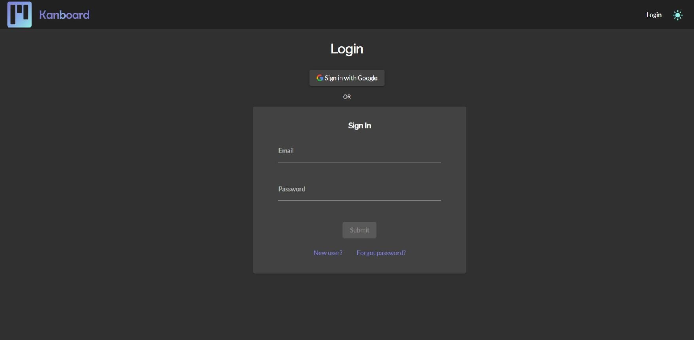
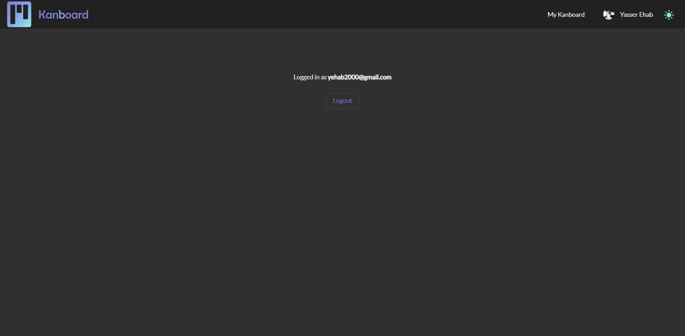
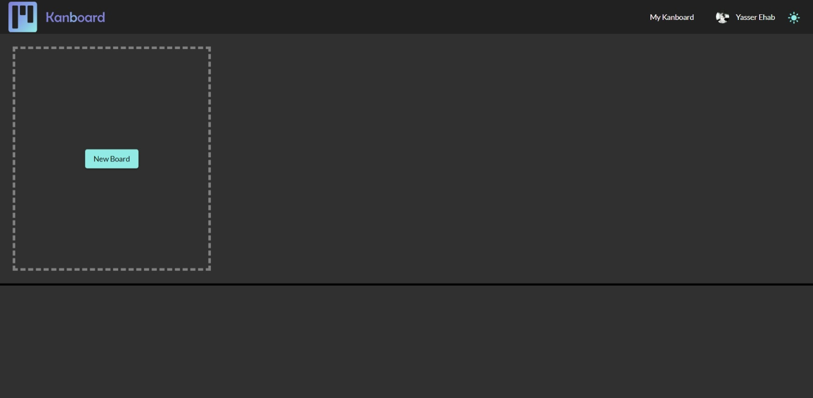
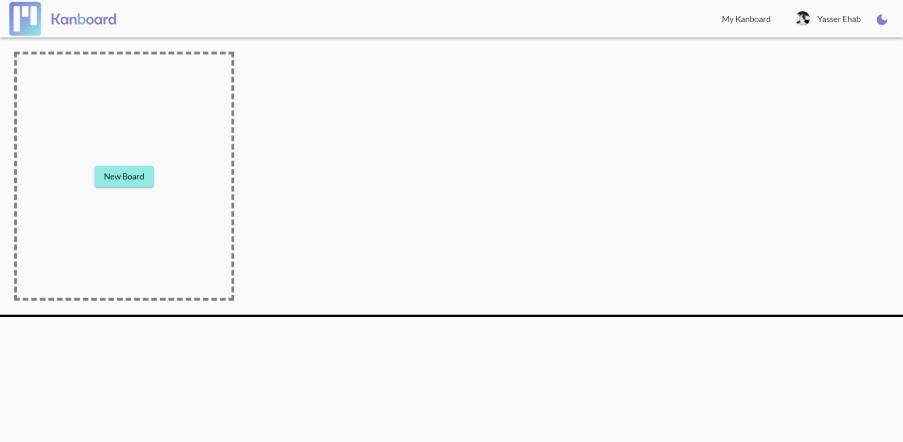
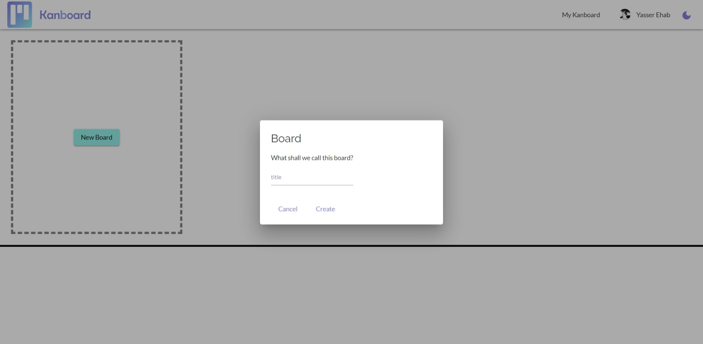
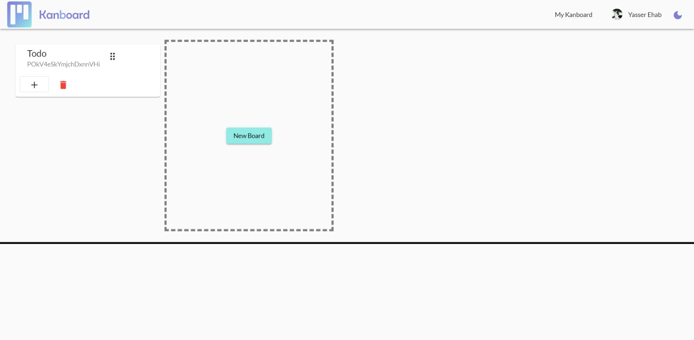
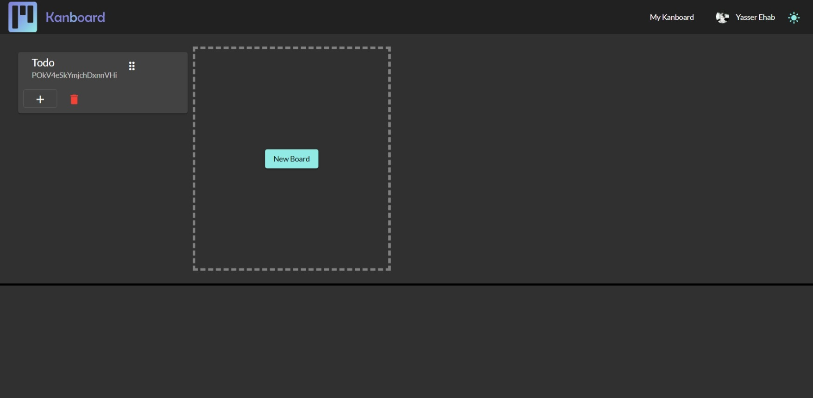
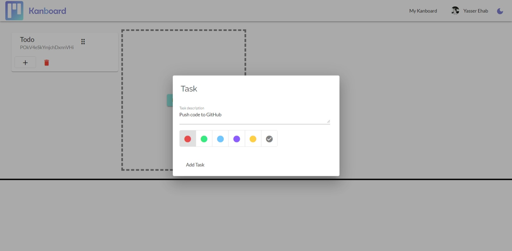
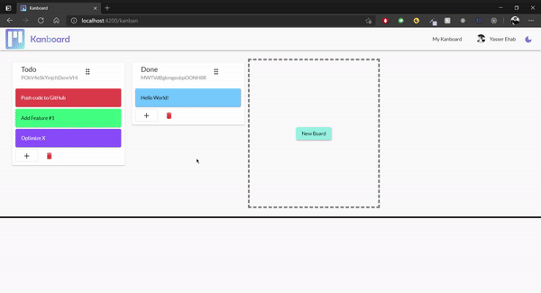

# Kanboard

<!-- PROJECT LOGO -->
 

    
    
    

## Description

Kanboard is a web-based, Kanban-style, list-making application. It is a web application that allows users to create and manage Kanban boards.

## Built With

- [Angular](https://angular.io/) 
- [Angular Material](https://material.angular.io/) 
- [Firebase](https://firebase.google.com/) 

## Development server

Run `ng serve` for a dev server. Navigate to `http://localhost:4200/`.

## Screenshots

### Auth

### Kanban Board

#### Drag and Drop

